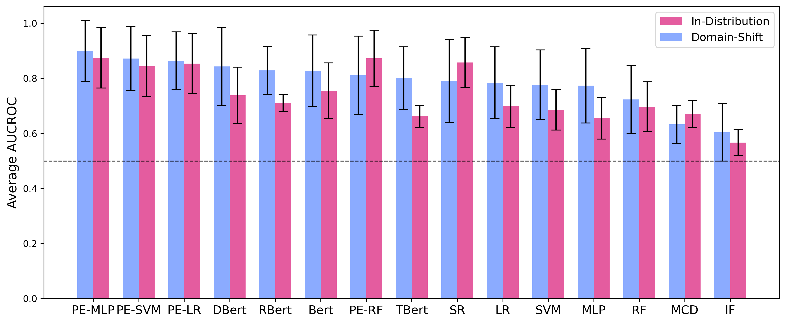

# Abstention is All You Need

This repository contains the code for the paper *"Abstention is All You Need"*.

---

## Data preparation

- **`dependencies/basic_functions.py`** – Core helper functions (e.g., training rejectors, tracking time).
- **`correctnessDatasetCreation.ipynb`** – Precomputes correctness datasets with PHI as predictor and stores them in the dependencies folder.
- **`runner.py`** – Main pipeline: loads datasets and models, creates (if necessary) or loads correctness datasets, trains rejector models, saves results as pickle files in `results/`.
- **`prepareResults.py`** – Loads individual pickle results, computes metrics, and outputs aggregate files.
- **`requirements.txt`** – Python dependencies to reproduce the environment.
- **`results/`** – Contains all experiment results as pickle files. (placeholder)

## Notebooks for visualizations (analysis & figures)

- **`visualizations/Result_Dash.py`** – Opens a dashboard to analyze all collected data
- **`visualizations/Exp1_Classifier.ipynb`** – Analyzes Experiment 1 to explore the impact of the rejector model.  
- **`visualizations/Exp1_Embedding.ipynb`** – Analyzes Experiment 1 to explore the impact of the embedding method.  
- **`visualizations/Exp1_Embedding_Differences.ipynb`** – Creates diagrams for the embedding experiment.  
- **`visualizations/Exp2.ipynb`** – Analyzes the results of Experiment 2.  
- **`visualizations/Exp3.ipynb`** – Analyzes the results of Experiment 3.  
- **`visualizations/Exp3_Time.ipynb`** – Analyzes Experiment 3 with a focus on time consumption.  
- **`visualizations/Exp4.ipynb`** – Analyzes the results of Experiment 4.  
- **`visualizations/appendix_Exp4.ipynb`** – Creates diagrams for the appendix related to Experiment 4.  
- **`visualizations/Exp5.ipynb`** – Analyzes the results of Experiment 5.
- **`visualizations/STD.ipynb`** – Analyzes the experiment results regarding model variance.  

## Precomputed Data

In order to skip the computation of correctness datasets, the training of rejectors, and the aggregation of results, we provide intermediate outputs in `.zip` files. In particular, `dependencies/correctnessDatasets.zip` contains precomputed correctness datasets and helper data, `dependencies/TriviaQA.zip` contains computations with the TriviaQA dataset, and `visualizations/results.zip` contains the aggregated results of all experiments, ready to use for visualizations.

## Datasets

In this section, the datasets used in the conducted experiments are described in detail. Table [T1](#table-1) lists all datasets along with their names, associated categories, training and test sizes, and a brief description of the input and expected output. We extracted the datasets using the *datasets* library from the following sources:

- **Spam** and **Spam-text**:  
  `load_dataset("SetFit/enron_spam")`

- **AgNews**:  
  `load_dataset("fancyzhx/ag_news")`

- **Sentiment**:  
  `load_dataset("Sp1786/multiclass-sentiment-analysis-dataset")`

- **QA (SQuAD)**:  
  `load_dataset("rajpurkar/squad")`

- **Movie-rating**:  
  `load_dataset("yashraizad/yelp-open-dataset-top-reviews")`

- **Time-series**:  
  `load_dataset("naimul011/Electricity_Load_Forecasting_using_LLMS")`

- **Spell-check** *(first column used)*:  
  `load_dataset("sentence-transformers/stsb")`

- **GLUE benchmark tasks** (e.g., CoLA):  
  `load_dataset("glue", "cola")`

**T1: Datasets with their names, corresponding categories, training and test sizes, and input and output descriptions. Note that datasets with more than 10,000 training samples and 2,000 test samples were pruned.**

| Dataset     | Category                  | Size (train/test) | Input                        | Output |
|-------------|---------------------------|-------------------|------------------------------|--------|
| Spam        | Binary Classification     | 10,000 / 2,000    | Email Subject                | ham / spam |
| Spam-text   | Binary Classification     | 10,000 / 2,000    | Email Content                | ham / spam |
| AgNews      | Multiclass Classification | 10,000 / 2,000    | News article                 | Category label |
| Sentiment   | Multiclass Classification | 10,000 / 2,000    | Sentence                     | positive / neutral / negative |
| QA (SQuAD)  | Extractive QA             | 10,000 / 2,000    | Question + context           | Extracted text answer |
| Movie-rating| Regression                | 10,000 / 2,000    | Movie review                 | 1–5 rating |
| Time-series | Regression                | 10,000 / 2,000    | 5 floats                     | Next float |
| Spell-check | Generative                | 10,000 / 2,000    | Sentence with errors         | Corrected sentence |
| GLUE QNLI   | Binary Classification     | 10,000 / 2,000    | Question + context           | answerable / not |
| GLUE RTE    | Binary Classification     | 2,490 / 277       | Premise + hypothesis         | entailment / not |
| GLUE STSB   | Regression                | 5,749 / 1,500     | Sentence pair                | Similarity score (1–5) |
| GLUE WNLI   | Binary Classification     | 635 / 71          | Premise + hypothesis         | entailment / not |
| GLUE SST2   | Binary Classification     | 10,000 / 872      | Sentence                     | positive / negative |
| GLUE MRPC   | Binary Classification     | 3,668 / 408       | Sentence pair                | paraphrase / not |
| GLUE MNLI   | Multiclass Classification | 10,000 / 2,000    | Premise + hypothesis         | entailment / contradiction / neutral (matched = out-of-domain test set & mismatched = in-domain test set) |
| GLUE COLA   | Binary Classification     | 8,551 / 1,043     | Sentence                     | grammatically acceptable / not |
| GLUE QQP    | Binary Classification     | 10,000 / 2,000    | Question pair                | duplicate / not |

*Note: GLUE MNLI consists of two test sets (mismatched and matched) and is therefore treated as two separate datasets in all experiments.

## Predictor, Rejector Models & Embeddings

This section lists the libraries and hyperparameters for each predictor, rejector model, and embedding method.

- **Random Forest**
  - Library: `sklearn.ensemble.RandomForestClassifier`
  - Parameters: `n_estimators = 100`

- **Support Vector Machine (SVM)**
  - Library: `sklearn.linear_model.SGDClassifier`
  - Parameters: `loss = 'hinge'`

- **Multilayer Perceptron (MLP)**
  - Library: `PyTorch`
  - Parameters:  
    `Hidden Layer = 64, ReLU activation, Loss = BCEWithLogitsLoss, Optimizer = Adam, Epochs = 200, Learning Rate = 0.001`

- **Logistic Regression**
  - Library: `sklearn.linear_model.LogisticRegression`
  - Parameters: `max_iter = 1000`

- **Isolation Forest**
  - Library: `sklearn.ensemble.IsolationForest`
  - Parameters: `contamination = 0.1, n_estimators = 300`

- **TF-IDF**
  - Library: `sklearn.feature_extraction.text.TfidfVectorizer`
  - Parameters: `max_features = 5000`

- **BERT**
  - Used as a rejector model and embedding method
  - Source: HuggingFace → `google-bert/bert-base-uncased`

- **RoBERTa**
  - Used as a rejector model and embedding method; and as a predictor (Standard Deviation, Softmax Response, Exp3 Baselines, Exp3 Time)
  - Source: HuggingFace → `facebookai/roberta-base`

- **DistilBERT**
  - Used as a rejector model and embedding method
  - Source: HuggingFace → `distilbert/distilbert-base-uncased`

- **TinyBERT**
  - Used as a rejector model and embedding method
  - Source: HuggingFace → `huawei-noah/TinyBERT_General_4L_312D`

- **Phi-3**
  - Used as a predictor
  - Source: HuggingFace → `microsoft/Phi-3-medium-4k-instruct`

## Determining Model Variability across multiple runs

As an initial experiment, we measured the variance of the models across multiple runs. Specifically, we selected the RoBERTa model as the predictor (to save computational resources) and tested it on the AgNews dataset. For each sample tested, we recorded the correctness of the model's predictions to create the correctness dataset, as detailed in the methodology. Each rejector model was then trained 10 times using the same set of 10,000 samples from the correctness dataset, but with the sample order shuffled in each iteration. For models requiring numerical input, we pre-embedded the data using the embeddings from the RoBERTa model (predictor). After training, we evaluated each rejector model on a test set of 2,000 samples from the correctness dataset. During this evaluation, we measured the Area Under the Accuracy-Coverage curve (AUCAC) and the Area Under the Receiver Operating Characteristic curve (AUCROC). More details on these metrics are provided in the problem statement and in the experiment 1, respectively.
Figure [F1](#fig-1) illustrates the Coefficient of Variation (CV) for each model across both metrics. We set a CV threshold of 5\% as a limit to determine acceptable variance in model performance. As shown, all models achieved a CV below this threshold on both metrics. This result indicates that the variance in the models' results is low enough for a single run per model to provide reliable outcomes. 

**F1: Variance across 10 runs for rejector models illustrated by the Coefficient of Variation (CV) of AUCROC and AUCAC; abbreviations: RF = Random Forest, LR = Logistic Regression, IF = Isolation Forest, MCD = Monte Carlo Dropout, AUCROC = Area Under the Receiver Operating Characteristic curve, AUCAC = Area Under the Accuracy-Coverage curve.**

## Softmax Response Under Domain-Shift

In order to demonstrate that Softmax Response lags in performance when applied within a domain-shift setting, we fine-tuned three RoBERTa models on three different datasets (Spam, Spam-text, and Sentiment), serving as in-distribution predictors. For domain-shift predictors, we downloaded RoBERTa models from HuggingFace:

- **Sentiment**: [`cardiffnlp/twitter-roberta-base-sentiment-latest`](https://huggingface.co/cardiffnlp/twitter-roberta-base-sentiment-latest)  
- **Spam** and **Spam-text**: [`mshenoda/roberta-spam`](https://huggingface.co/mshenoda/roberta-spam)  

that were also fine-tuned on spam detection and sentiment analysis, but not directly on our selected datasets. We then used the predictors to create correctness datasets to train our rejectors and tested them, as well as both baselines (Monte Carlo Dropout and Softmax Response) on the test sets. The achieved average AUCROC scores, as well as the standard deviations for the in-distribution predictors and the domain-shift predictors, are displayed in Figure [F2](#fig-2), with concrete results in Table [T2](#table-2). As shown, Softmax Response achieves an average AUCROC score of 0.792 in the domain-shift setting, which is lower than 0.858 in the in-distribution setting. Conversely, the transformer models all achieve a higher average AUCROC score in the domain-shift setting, with approximately 0.83 compared to 0.72 in the in-distribution setting. Similarly, our white-box approach, which uses predictor embeddings, achieves a higher average AUCROC score with 0.900 in the domain-shift setting and 0.875 in the in-distribution setting, but with a smaller gap between the settings.
As a result, Softmax Response benefits from an in-distribution setting, where the model is tested on data from the same source as the training data. In the third experiment, we therefore fine-tuned the predictor (RoBERTa, to save computation time) to ensure that the Softmax Response baseline performed as strongly as possible. However, although our selective prediction system performs better in a domain-shift setting, our white-box approach still outperforms Softmax Response in the in-distribution setting. Furthermore, our transformer-based rejectors surpass Softmax Response in the domain-shift setting and almost reach its performance in the in-distribution setting.

**F2: Achieved average AUCROC scores and standard deviations across selected classification tasks under in-distribution and domain-shift settings; with abbreviations as in Figure [F1](#fig-1), except: PE = Predictor Embedding, SR = Softmax Response.**

**T2: Achieved average AUCROC scores and standard deviations (STD) across selected classification tasks under in-distribution and domain-shift settings; with abbreviations as in Figure [F1](#fig-1), except: PE = Predictor Embedding, SR = Softmax Response.**

| Rejector Model | Domain-Shift avg AUCROC | Domain-Shift avg STD | In-Distribution avg AUCROC | In-Distribution avg STD |
|----------------|--------------------------|-----------------------|-----------------------------|--------------------------|
| PE             | 0.900                    | 0.110                 | 0.875                       | 0.110                    |
| DBert          | 0.843                    | 0.142                 | 0.739                       | 0.102                    |
| RBert          | 0.830                    | 0.087                 | 0.710                       | 0.031                    |
| Bert           | 0.828                    | 0.130                 | 0.755                       | 0.101                    |
| TBert          | 0.801                    | 0.113                 | 0.663                       | 0.040                    |
| SR             | 0.792                    | 0.151                 | 0.858                       | 0.091                    |
| LR             | 0.785                    | 0.130                 | 0.699                       | 0.076                    |
| SVM            | 0.778                    | 0.126                 | 0.686                       | 0.073                    |
| MLP            | 0.774                    | 0.136                 | 0.656                       | 0.076                    |
| RF             | 0.724                    | 0.123                 | 0.697                       | 0.090                    |
| MCD            | 0.633                    | 0.069                 | 0.670                       | 0.049                    |
| IF             | 0.605                    | 0.105                 | 0.567                       | 0.048

## Time Consumption

For a comparison between our selective prediction system and the two baselines, Softmax Response and Monte Carlo Dropout, regarding time consumption, we measured the setup time and the inference time required by each rejector model. A detailed description of these metrics is provided in Experiment 3. While we measured these metrics for all 18 datasets, we display results for only three settings (the spell-check dataset with Phi, AgNews with Phi[^1], and AgNews with RoBERTa as a predictor), as the results from the other datasets do not provide additional insights. However, you can simply compute the times using the code provided in this repository, or use the precomputed results in `visualizations/results.zip`.

[^1]: In order to apply the Softmax Response to Phi, we added a classification head on top of the predictor. To achieve similar prediction results with this adaptation, we needed to fine-tune the model. Therefore, we used [LoRA](https://arxiv.org/pdf/2106.09685) and [Unsloth](http://github.com/unslothai/unsloth) as fast and computationally efficient fine-tuning techniques and fine-tuned a suitable Phi model (HuggingFace: unsloth/Phi-3-medium-4k-instruct).